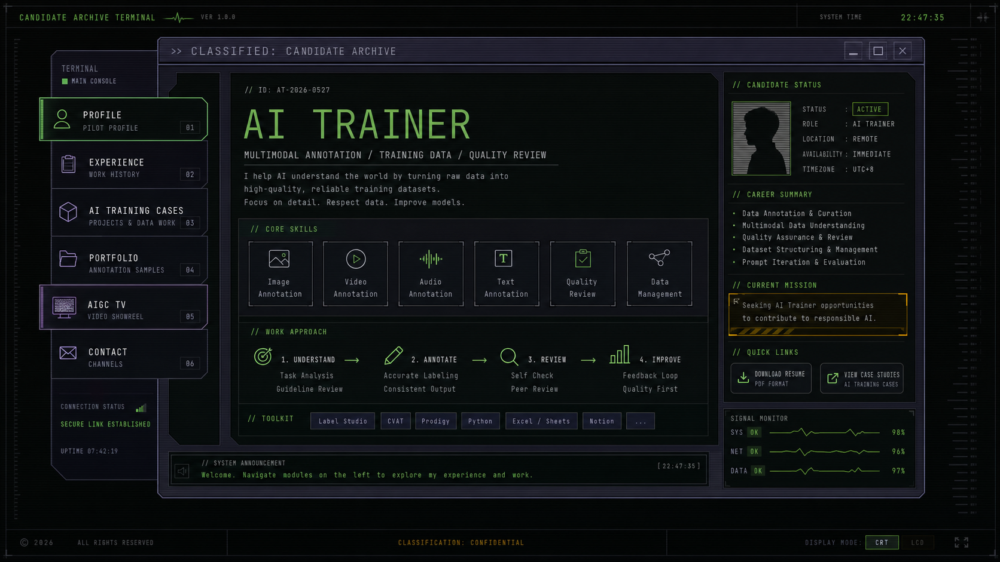

# AI Trainer Personal Website - Design Document

**Version:** v0.3  
**Date:** 2026-05-27  
**Status:** Draft, pending user confirmation  
**Gate Level:** L2 asset-first visual refresh  

---

## Iteration History

### v0.3 - 2026-05-27
- Locked the visible desktop UI list to exactly 10 app icons: About, Project, Contact, Blog, IP, My World, Music, Guest, AIGC TV, Dont Click.
- Removed `Cestino` from the visible desktop UI and retired the old `Links`, `Guestbook`, `loop TV`, `Lite Bulb`, and random corrupted filename labels.
- Added the icon design brief: `docs/design/icon-design-brief.md`.

### v0.2 - 2026-05-27
- Corrected the design scope: preserve the current command-window size, UI scale, icon grid, and retro OS layout.
- Reframed the work as an asset-first refresh: background pattern, icon/UI images, titlebar/window skin, and AIGC TV standby imagery.
- Marked the v0.1 large terminal-dashboard restructuring as too broad for the next implementation step.
- Added a dedicated asset replacement plan: `docs/design/asset-replacement-plan.md`.

### v0.1 - 2026-05-27
- Created the first design system draft for repositioning the site from a retro desktop clone into an AI Trainer job-seeking portfolio.
- Preserved the desktop/window metaphor, but redirected it toward an original mecha-control-terminal and classified-archive interface.
- Defined the future `AIGC TV` direction as a full-screen AIGC video showreel placeholder, with real video assets to be added later.
- Added a visual direction preview asset: `docs/design/assets/ai-trainer-control-terminal-preview.png`.

---

## 0. Current Scope Lock

The next design and implementation pass must **not** reshape the site into a new dashboard.

Preserve these existing dimensions and interaction proportions:

| Element | Existing Constraint | Decision |
|---|---:|---|
| Main window | `width: min(640px, calc(100vw - 24px))` | Keep |
| Titlebar | `min-height: 34px` | Keep |
| Titlebar buttons | `28px x 26px` | Keep |
| Desktop area | `min-height: 292px`, `padding: 10px` | Keep |
| Desktop icon button | `84px x 84px` | Keep |
| Icon image | `48px x 48px` | Keep |
| Desktop grid | `repeat(6, 84px)`, gap `10px 12px` | Keep |
| Footer buttons | two columns, `min-height: 36px` | Keep |
| Statusbar | `min-height: 18px` | Keep |
| Mobile grid | 3 columns, then 2 columns below 340px | Keep |

Allowed next-step changes:

- Replace the wallpaper/background motif.
- Replace or redraw icon images while keeping their pixel dimensions.
- Adjust titlebar/window skin colors and textures.
- Rename or repurpose desktop icons without changing the grid size.
- Add AIGC TV placeholder imagery inside the existing `loop TV` slot.
- Update popup content styling within the existing popup-window system.

Not allowed in the next step:

- No new full-page dashboard layout.
- No resizing the main command window.
- No changing icon button dimensions.
- No replacing the desktop grid with a sidebar.
- No moving the experience into a large hero layout.
- No 3D scene or cinematic landing page.

---

## 1. Product And Aesthetic Positioning

### 1.1 Product Goal

The website is a personal job-seeking portfolio for AI Trainer roles. Its first job is not to impress with theme alone; it must help recruiters understand, within 30 seconds:

- The candidate is targeting AI Trainer / AI data training roles.
- The candidate has experience around data annotation, training-data construction, multimodal content review, AIGC video work, quality review, and project organization.
- The candidate has a portfolio and case material worth opening.

### 1.2 Target Audience

- Recruiters screening AI Trainer, data annotation, AIGC operation, or multimodal data roles.
- Hiring managers who need evidence of process thinking, quality control, and content judgment.
- Interviewers who may use the site to navigate the candidate's project examples.

### 1.3 Design Direction

**Current recommended direction:** Retro OS Asset Refresh

Keep the original screenshot's command-window scale and desktop metaphor. Apply the AI Trainer / EVA-inspired direction through bitmap and CSS skin changes first:

- A new tiled background pattern.
- New 48px pixel icons for role-focused modules.
- A darker titlebar and chrome skin.
- AIGC TV standby art in the existing `loop TV` icon slot.
- Popup contents rewritten as job-seeking evidence windows.

The v0.1 "Candidate Archive Terminal" remains useful as mood reference, but it is no longer the implementation shape for the next step.

### 1.4 Aesthetic Options Considered

| Option | Description | Strength | Risk | Decision |
|---|---|---|---|---|
| Retro Desktop Resume | Keep current desktop almost unchanged and rename icons. | Lowest implementation cost. | Still feels like a clone, not the user's own site. | Not primary |
| Asset-First Retro OS Refresh | Keep current command window and UI scale, replace background/icons/window skin. | Matches user constraint and protects the original charm. | Impact depends on asset quality. | Recommended |
| Candidate Archive Terminal | Dark terminal, archive modules, job evidence, restrained mecha-control style. | Strong identity and readable for hiring. | Too much shape/layout change for current scope. | Mood reference only |
| Full EVA-Like Console | Maximal alarms, sync ratios, high-intensity animated console. | Highest visual punch. | Can look too game-like and hurt recruitment clarity. | Use only as accent |
| Minimal Portfolio | Clean portfolio with only small terminal details. | Recruiter-friendly. | Loses the memorable concept. | Fallback |

### 1.5 Design Principles

1. **Recruiter clarity before theme**  
   Every visual panel must answer a hiring question: who is this, what role, what proof, how to contact.

2. **Archive, not arcade**  
   The interface can feel tactical and cinematic, but it should read like a professional evidence system rather than a game menu.

3. **Preserve useful nostalgia**  
   Keep draggable windows, scanline mood, and icon launching where they help exploration. Remove novelty modules that do not serve the job search.

4. **AIGC work must explain the role**  
   Video playback is not enough. Each video needs metadata showing task type, role, process, and tags.

5. **Original inspiration only**  
   Use an original mecha terminal language. Do not use official franchise names, logos, character art, or recognizable symbols.

---

## 2. Design Tokens

### 2.1 Primitive Colors

| Token | Value | Purpose |
|---|---:|---|
| `--black-950` | `#050507` | Page background |
| `--black-900` | `#0b0d10` | Main shell |
| `--panel-850` | `#15111d` | Purple-black panels |
| `--panel-800` | `#1d1729` | Raised surfaces |
| `--line-700` | `#393247` | Structural border |
| `--green-400` | `#6cff7a` | System OK, live status |
| `--green-300` | `#9effa6` | Highlight text |
| `--amber-400` | `#ffb02e` | Warnings, active modules |
| `--orange-500` | `#ff6b26` | Primary CTA and alert |
| `--cyan-400` | `#44d8ff` | Signal lines, secondary accents |
| `--red-500` | `#ff3b3b` | Error and destructive states |
| `--text-100` | `#ece9f2` | Primary text |
| `--text-300` | `#c8c0d8` | Body text |
| `--text-500` | `#8f879c` | Muted text |

### 2.2 Semantic Colors

| Token | Value | Use |
|---|---:|---|
| `--color-bg` | `var(--black-950)` | Body background |
| `--color-surface` | `var(--panel-850)` | Window and panel background |
| `--color-surface-raised` | `var(--panel-800)` | Focused windows and cards |
| `--color-border` | `var(--line-700)` | Panel edges |
| `--color-text` | `var(--text-100)` | Primary copy |
| `--color-muted` | `var(--text-500)` | Secondary labels |
| `--color-primary` | `var(--green-400)` | System status, module labels |
| `--color-accent` | `var(--amber-400)` | Selected state |
| `--color-cta` | `var(--orange-500)` | Resume/contact actions |
| `--color-info` | `var(--cyan-400)` | AIGC TV signal and links |
| `--color-danger` | `var(--red-500)` | Error states |

### 2.3 Typography

| Role | Font | Size | Weight | Line Height | Use |
|---|---|---:|---:|---:|---|
| Display | `Space Grotesk`, system sans | 40-56px | 600 | 1.05 | Candidate name / role |
| Section title | `Space Grotesk`, system sans | 24-32px | 600 | 1.15 | Window titles |
| Body | `Archivo`, system sans | 16-18px | 400 | 1.55 | Long-form content |
| UI label | `JetBrains Mono`, monospace | 12-14px | 500 | 1.25 | Module IDs, tags, statuses |
| Data | `JetBrains Mono`, monospace | 14-16px | 400 | 1.35 | Metrics, case metadata |

Rationale:

- A pure monospace site would match the terminal mood, but long resume text would become tiring.
- `Space Grotesk + Archivo` keeps portfolio readability.
- `JetBrains Mono` supplies the control-terminal layer for labels, metadata, and AIGC TV overlays.

### 2.4 Spacing

| Token | Value | Use |
|---|---:|---|
| `--space-1` | `4px` | Micro gaps |
| `--space-2` | `8px` | Compact UI grouping |
| `--space-3` | `12px` | Labels and tags |
| `--space-4` | `16px` | Component padding |
| `--space-6` | `24px` | Panel padding |
| `--space-8` | `32px` | Section rhythm |
| `--space-12` | `48px` | Large layout separation |

### 2.5 Radius And Edge Language

| Token | Value | Use |
|---|---:|---|
| `--radius-none` | `0` | Terminal panels, main shell |
| `--radius-sm` | `4px` | Tags, small buttons |
| `--radius-md` | `8px` | Repeated case cards only |

Use angular panel edges as the default. Avoid large rounded cards; they conflict with the tactical terminal mood.

### 2.6 Motion

| Token | Value | Use |
|---|---:|---|
| `--duration-fast` | `120ms` | Press states |
| `--duration-base` | `220ms` | Window open/close |
| `--duration-signal` | `480ms` | Static transition |
| `--ease-terminal` | `cubic-bezier(.2,.8,.2,1)` | Most UI transitions |

Must respect `prefers-reduced-motion`: reduce static flicker, boot animation, and scanline movement.

---

## 3. Information Architecture

### 3.1 Main Modules

The visible desktop UI is locked to these 10 app icons:

| Order | Label | Purpose |
|---|---|---|
| 1 | About | Personal intro and AI Trainer positioning |
| 2 | Project | Portfolio case entry point |
| 3 | Contact | Email, resume, and contact actions |
| 4 | Blog | Notes or articles |
| 5 | IP | Personal IP / identity positioning |
| 6 | My World | Personal worldview, interests, and creative context |
| 7 | Music | Music-related personal module |
| 8 | Guest | Guest messages, recommendations, or feedback |
| 9 | AIGC TV | Future AIGC video showreel placeholder |
| 10 | Dont Click | Playful warning / hidden interaction slot |

Removed from visible desktop UI:

- `Cestino`
- Old `Links` label
- Old `Guestbook` label
- Old `loop TV` label
- Old `Lite Bulb` label
- Old random corrupted filename label

### 3.2 Recommended First Screen

The first screen should communicate:

1. Candidate name and target role.
2. Three proof tags: `Multimodal Annotation`, `Training Data`, `Quality Review`.
3. Primary actions: `Open Portfolio`, `View AI Training Cases`, `Contact / Resume`.
4. Visual identity: original dark terminal interface, not a generic landing page.

### 3.3 Desktop Layout

```text
+--------------------------------------------------------------+
| Portfolio.rb titlebar                                         |
+--------------------------------------------------------------+
| About   Project Contact Blog    IP      My World              |
| Music   Guest   AIGC TV Dont Click                            |
|                                                              |
|                      existing desktop area                    |
|                                                              |
+--------------------------------------------------------------+
| Footer buttons, statusbar, CRT/LCD switch                     |
+--------------------------------------------------------------+
```

### 3.4 Mobile Layout

Mobile should not shrink the desktop window until it becomes unreadable. It should switch to:

- Top compact status bar.
- Horizontal scroll module tabs.
- One active module per screen.
- AIGC TV as a full-width tile, later opening a full-screen viewer.
- Contact / resume action sticky near the bottom only if it does not cover content.

---

## 4. Component Specifications

### 4.1 Archive Shell

**Use:** Main site container.

**Visual:** Angular dark window, 1px structural borders, thin internal scan texture, restrained glow on focused borders.

**States:**

| State | Visual |
|---|---|
| Default | Dark panel, muted border, readable text |
| Focused | Green/cyan edge highlight |
| Loading | Boot text lines, then reveal |
| Reduced motion | Static reveal without flicker |

### 4.2 Module Button

**Use:** Opens one content area or window.

**Visual:** Icon or compact symbol, uppercase label, module ID, optional status dot.

**States:**

| State | Visual |
|---|---|
| Default | Muted border, green label |
| Hover | Amber left edge, brighter label |
| Active | Amber background strip, dark text segment |
| Focus-visible | 2px cyan outline, no outline removal |
| Disabled | Dimmed text, visible reason in tooltip or status line |

### 4.3 Evidence Window

**Use:** Displays Profile, Experience, Portfolio, AI Training Cases.

**Structure:**

- Header: module ID, title, close/focus controls.
- Body: summary first, evidence details second.
- Footer: tags, next action, source/date if relevant.

**Rule:** Avoid decorative nested cards. Use rows, dividers, metadata strips, and compact panels.

### 4.4 Case Record

**Use:** Individual project/case entry.

**Fields:**

- `Case ID`
- `Title`
- `Task Type`
- `Input / Data Type`
- `Role`
- `Process`
- `Quality Review`
- `Output / Result`
- `Artifacts`

**Writing direction:** Use annotation-first and training-data wording. Avoid making the work sound like generic model evaluation unless a specific case truly is evaluation.

### 4.5 AIGC TV Tile

**Use:** Desktop entry into future video showreel.

**Current state:** Placeholder until user has real videos.

**Visual:** Small monitor tile or signal window with `AV-00`, static texture, and `Awaiting Footage` / `AIGC Reel Standby`.

**Interaction now:** Opens a placeholder window explaining that video reels will be added later.

**Interaction later:** Opens full-screen player.

### 4.6 Full-Screen AIGC TV Player

**Future component, not required for first design implementation.**

**Behavior:**

- Click `AIGC TV` to enter full-screen playback.
- Video fills the viewport with object-fit cover or contain depending on asset ratio.
- Click page to advance to next video.
- Between videos, show static/no-signal transition for 480-800ms.
- `Esc` exits.
- Arrow keys navigate previous/next.
- Power button exits to desktop.

**Overlay metadata:**

```text
AV-01 / AIGC VIDEO CASE
Title: 作品标题
Task: Text-to-Video / Image-to-Video / Visual Consistency
Role: Prompt iteration, clip selection, annotation notes
Tags: AIGC, multimodal, QA, training data
```

---

## 5. Interaction Model

### 5.1 Primary Journey

```text
Open site
-> Candidate Archive loads
-> Recruiter reads AI Trainer positioning
-> Opens AI Training Cases or Portfolio
-> Reviews role/process/result evidence
-> Opens Contact / Resume
```

### 5.2 Secondary Journey

```text
Open site
-> Click AIGC TV
-> See placeholder or video reel
-> Return to archive
-> Open matching case detail
```

### 5.3 Rules

- The site must remain usable without interacting with novelty elements.
- Any animation must have a short path to readable content.
- AIGC TV must not trap users; exit controls must be obvious.
- External links should visually indicate they leave the site.
- Keyboard navigation must be supported for all module controls.

---

## 6. Empty, Loading, And Error States

### 6.1 AIGC TV Empty State

Until videos exist:

```text
AIGC REEL STANDBY
No footage loaded yet.
This channel is reserved for selected AIGC video works.
```

Optional metadata:

- `Signal: standby`
- `Assets: 0 loaded`
- `Next: add video files to public/videos`

### 6.2 Case Empty State

If case details are not ready:

```text
CASE FILE PENDING
This record is being organized.
```

Avoid playful filler that undermines professionalism.

### 6.3 Loading

Use short terminal-style lines:

```text
loading candidate archive...
indexing project cases...
signal stable
```

Animation should finish quickly and be skipped or reduced for accessibility.

---

## 7. Visual Decision Record

### 7.1 Generated Preview



**Decision purpose:** Test whether an original mecha-control terminal can support recruiter-facing portfolio content without becoming a game-like interface.

**Observed direction:** The left module nav, central candidate archive, and side status panel are useful. The final implementation should be less glossy and more readable than the preview, with stronger real text hierarchy.

**Prompt summary:** Generate a 16:9 desktop UI mockup for an AI Trainer personal portfolio using an original 1990s mecha-anime control-terminal aesthetic; include modules for Profile, Experience, AI Training Cases, Portfolio, AIGC TV, and Contact; avoid copyrighted logos, characters, and official franchise symbols.

### 7.2 Current Design Decision

Adopt the **Asset-First Retro OS Refresh** direction as the working draft.

Use the v0.1 generated preview only as a broad mood exploration. It should not drive layout, proportions, or page shape.

Rejected extremes:

- Do not keep the site as a near-direct retro desktop clone.
- Do not make the page so cinematic that it hides resume information.
- Do not use official EVA/NERV-style marks or character references.
- Do not enlarge or reshape the main command window in the next pass.

---

## 8. Design Quality Review

### 8.1 Current Design Score

| Dimension | Score | Reason |
|---|---:|---|
| Information architecture | 8/10 | Role and evidence flow are clear; final content still needed. |
| Visual hierarchy | 7/10 | Strong shell concept; must avoid over-dense panels. |
| Recruiter usability | 8/10 | Modules map to hiring needs. |
| Originality | 8/10 | Keeps the retro-window charm while changing meaning. |
| Accessibility | 6/10 | Dark neon UI needs careful contrast, focus, and motion controls. |
| Mobile readiness | 6/10 | Needs dedicated mobile layout rather than a shrunken desktop. |
| Implementation readiness | 7/10 | Existing static HTML/CSS/JS can support v1; AIGC TV video phase comes later. |

**Overall grade:** B draft, pending user confirmation and content details.

### 8.2 Known Design Risks

- Too many warning colors can make the site feel like a game HUD instead of a job portfolio.
- Pure monospace typography can reduce readability for experience descriptions.
- Overusing scanlines/static can hurt accessibility and legibility.
- Empty AIGC TV must feel intentional, not broken, until videos are ready.
- If every module opens as a popup, recruiters may have to click too much to understand the candidate.

### 8.3 High-Impact Low-Work Improvements

1. Replace current novelty icons with role-focused modules.
2. Rewrite first-screen copy around `AI Trainer`, `Training Data`, `Multimodal Annotation`, and `Quality Review`.
3. Turn `loop TV` into an `AIGC TV` placeholder tile now, full video reel later.
4. Add `Contact / Resume` as a persistent visible action.
5. Keep only one or two playful retro interactions; remove the rest.

---

## 9. Open Decisions For User Confirmation

1. First-screen language: Chinese, English, or bilingual.
2. Whether `Blog` remains a local popup or later becomes an external link.
3. Whether `IP` means personal brand/IP positioning, intellectual property, or another user-specific meaning.
4. Whether the site should expose resume download immediately in the first screen.

---

## 10. Next Step

After this design draft is confirmed, the next step is either:

- `forge-design-impl`: implement only the asset-first refresh: background, icon/UI images, skin colors, and AIGC TV standby state.
- `forge-prd`: formalize content and module naming before implementation if the user wants to lock text first.
